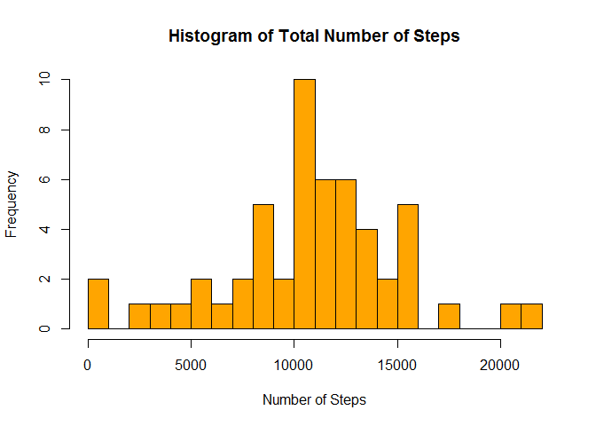
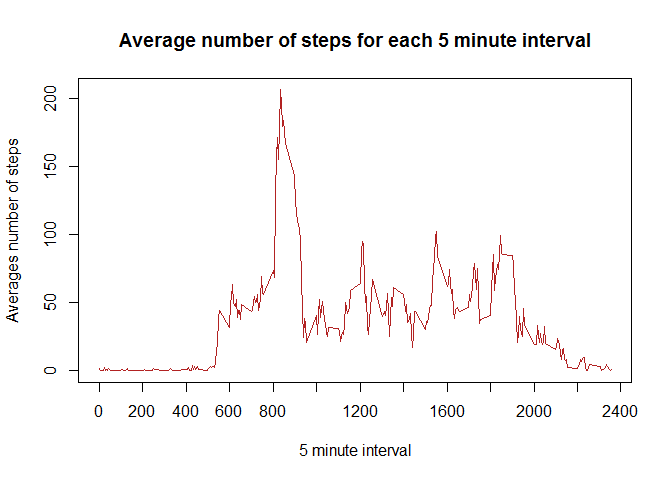
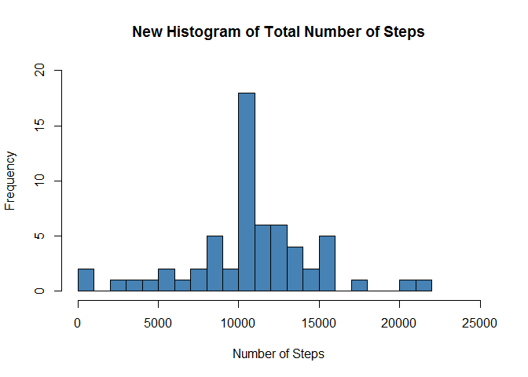
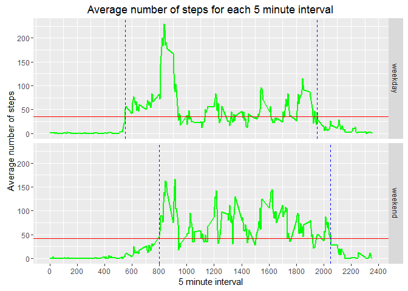

# Reproducible Research: Peer Assessment 1
### Basic settings

```r
echo = TRUE  # Make code always visible
options(scipen = 1)  # Turn off scientific notations for numbers
```

## Loading and preprocessing the data

```r
#1. Load the data (i.e. read.csv())
unzip("activity.zip")
activity_data <- read.csv("activity.csv", colClasses = c("integer", "Date", "factor"))

#2. Process/transform the data (if necessary) into a format suitable for your analysis
str(activity_data)
```

```
## 'data.frame':	17568 obs. of  3 variables:
##  $ steps   : int  NA NA NA NA NA NA NA NA NA NA ...
##  $ date    : Date, format: "2012-10-01" "2012-10-01" ...
##  $ interval: Factor w/ 288 levels "0","10","100",..: 1 226 2 73 136 195 198 209 212 223 ...
```

```r
head(activity_data)
```

```
##   steps       date interval
## 1    NA 2012-10-01        0
## 2    NA 2012-10-01        5
## 3    NA 2012-10-01       10
## 4    NA 2012-10-01       15
## 5    NA 2012-10-01       20
## 6    NA 2012-10-01       25
```

```r
activity_data$month <- as.Date(activity_data$date, "%Y-%m-%d")
head(activity_data)
```

```
##   steps       date interval      month
## 1    NA 2012-10-01        0 2012-10-01
## 2    NA 2012-10-01        5 2012-10-01
## 3    NA 2012-10-01       10 2012-10-01
## 4    NA 2012-10-01       15 2012-10-01
## 5    NA 2012-10-01       20 2012-10-01
## 6    NA 2012-10-01       25 2012-10-01
```

```r
#activity_data_na_omit <- na.omit(activity_data)
#rownames(activity_data_na_omit) <- 1:nrow(activity_data_na_omit)
#head(activity_data_na_omit)
#dim(activity_data_na_omit)
dim(activity_data)
```

```
## [1] 17568     4
```

```r
library(ggplot2)
library(grid)
```

## What is mean total number of steps taken per day?

```r
#1. Calculate the total number of steps taken per day
steps <- aggregate (steps~date, activity_data, FUN=sum, na.action=na.omit)

#2. Make a histogram of the total number of steps taken each day
hist(steps$steps, col = "orange", breaks = 20, 
  xlab = "Number of Steps", main = "Histogram of Total Number of Steps")
```

<!-- -->

```r
#3. Calculate and report the mean and median of the total number of steps taken per day
mean(steps$steps,na.rm=TRUE)
```

```
## [1] 10766.19
```

```r
median(steps$steps,na.rm=TRUE)
```

```
## [1] 10765
```

## What is the average daily activity pattern?

```r
#1. Make a time series plot (i.e. type = "l") of the 5-minute interval (x-axis) and the average number of steps taken, averaged across all days (y-axis)
intervalMean <- aggregate (x=list(steps=activity_data$steps), by=list(interval=as.numeric(as.character(activity_data$interval))), FUN=mean, na.rm=TRUE)
plot(intervalMean$interval, intervalMean$steps, type="l", xaxt="n", ylab="Averages number of steps", xlab="5 minute interval", main="Average number of steps for each 5 minute interval", col="firebrick") + 
  axis(1, c(seq(0, 22400, 200)))
```

<!-- -->

```
## numeric(0)
```

```r
#2. Which 5-minute interval, on average across all the days in the dataset, contains the maximum number of steps?
intervalMean[which.max(intervalMean$steps),]
```

```
##     interval    steps
## 104      835 206.1698
```

## Imputing missing values

```r
#1. Calculate and report the total number of missing values in the dataset (i.e. the total number of rows with NAs)
sum(is.na(activity_data$steps))
```

```
## [1] 2304
```

```r
#2. Devise a strategy for filling in all of the missing values in the dataset. The strategy does not need to be sophisticated. For example, you could use the mean/median for that day, or the mean for that 5-minute interval, etc.
#3. Create a new dataset that is equal to the original dataset but with the missing data filled in.
activity_data_modified <- activity_data
for (i in seq(0,2355,5))
{
    idx <- which(activity_data_modified$interval == i & is.na(activity_data_modified$steps))
    activity_data_modified[idx, "steps"] <- intervalMean[intervalMean$interval == i, "steps"]
}
sum(is.na(activity_data_modified$steps))
```

```
## [1] 0
```

```r
#4. Make a histogram of the total number of steps taken each day and Calculate and report the mean and median total number of steps taken per day. Do these values differ from the estimates from the first part of the assignment? What is the impact of imputing missing data on the estimates of the total daily number of steps?
newSteps <- aggregate (steps~date, activity_data_modified, FUN=sum)
hist(newSteps$steps, col = "steelblue", breaks = 20, 
  xlab = "Number of Steps", main = "New Histogram of Total Number of Steps", ylim = c(0,20), xlim = c(0, 25000))
```

<!-- -->

```r
mean(newSteps$steps)
```

```
## [1] 10766.19
```

```r
median(newSteps$steps)
```

```
## [1] 10766.19
```

## Are there differences in activity patterns between weekdays and weekends?

```r
#1. Create a new factor variable in the dataset with two levels - "weekday" and "weekend" indicating whether a given date is a weekday or weekend day.
activity_data <- read.csv("activity.csv", na.strings = "NA")
activity_data$date <- as.Date(activity_data$date, "%Y-%m-%d")
meanEachInterval <- aggregate(steps ~ interval, activity_data, mean)
activity_data_modified <- activity_data
for (int in seq(0, 2355, 5))
{
    idx <- which(activity_data_modified$interval == int & is.na(activity_data_modified$steps))
    activity_data_modified[idx, "steps"] <- meanEachInterval[meanEachInterval$interval == int, "steps"]
}
activity_data_modified$categoryDay <- format(activity_data_modified$date, "%u")
activity_data_modified$categoryDay[activity_data_modified$categoryDay %in% 1:5] <- "weekday"
activity_data_modified$categoryDay[activity_data_modified$categoryDay %in% 6:7] <- "weekend"
activity_data_modified$categoryDay <- as.factor(activity_data_modified$categoryDay)

options(scipen = 1000)
newIntervalMean <- aggregate(x=list(steps=activity_data_modified$steps), by=list(interval=as.numeric(as.character(activity_data_modified$interval)),categoryDay=as.factor(activity_data_modified$categoryDay)), mean)
# Means of weekdays and weekends
avgWeekDay <- mean(subset(newIntervalMean, categoryDay == "weekday")$step)
avgWeekEnd <- mean(subset(newIntervalMean, categoryDay == "weekend")$step)
# See "Explanations" below: Find the first and last intervals when the steps are above their means
startWeekDay <- min(subset(newIntervalMean, categoryDay == "weekday" & steps >= avgWeekDay)$interval)
endWeekDay <- max(subset(newIntervalMean, categoryDay == "weekday" & steps >= avgWeekDay)$interval)
startWeekEnd <- min(subset(newIntervalMean, categoryDay == "weekend" & steps >= avgWeekEnd)$interval)
endWeekEnd <- max(subset(newIntervalMean, categoryDay == "weekend" & steps >= avgWeekEnd)$interval)
# Lines we use for annotations
meanLines <- data.frame(categoryDay = c("weekday", "weekend"), mean = c(avgWeekDay, avgWeekEnd),
                        start = c(startWeekDay, startWeekEnd),
                        end = c(endWeekDay, endWeekEnd))

#2. Make a panel plot containing a time series plot (i.e. type = "l") of the 5-minute interval (x-axis) and the average number of steps taken, averaged across all weekday days or weekend days (y-axis). See the README file in the GitHub repository to see an example of what this plot should look like using simulated data.
ggplot(newIntervalMean, aes(interval, steps), col="steelblue") + geom_line(col="green", lwd=1) + facet_grid(categoryDay ~ .) +
  geom_hline(aes(yintercept = mean), data = meanLines, col = "red") + 
  geom_vline(aes(xintercept = start), data = meanLines, col = "blue", linetype = "dashed") +
  geom_vline(aes(xintercept = end), data = meanLines, col = "blue", linetype = "dashed") +
  labs(x = "5 minute interval", y = "Average number of steps", 
       title = "Average number of steps for each 5 minute interval") +
  scale_x_continuous(breaks = seq(0, 2400, 200))
```

<!-- -->

## Cleaning the environment variables

```r
rm("activity_data")
rm("activity_data_modified")
rm("steps")
rm("newSteps")
rm("intervalMean")
rm("meanEachInterval")
rm("idx")
rm("int")
rm("newIntervalMean")
rm("avgWeekDay")
rm("avgWeekEnd")
rm("startWeekDay")
rm("endWeekDay")
rm("startWeekEnd")
rm("endWeekEnd")
rm("meanLines")
```
